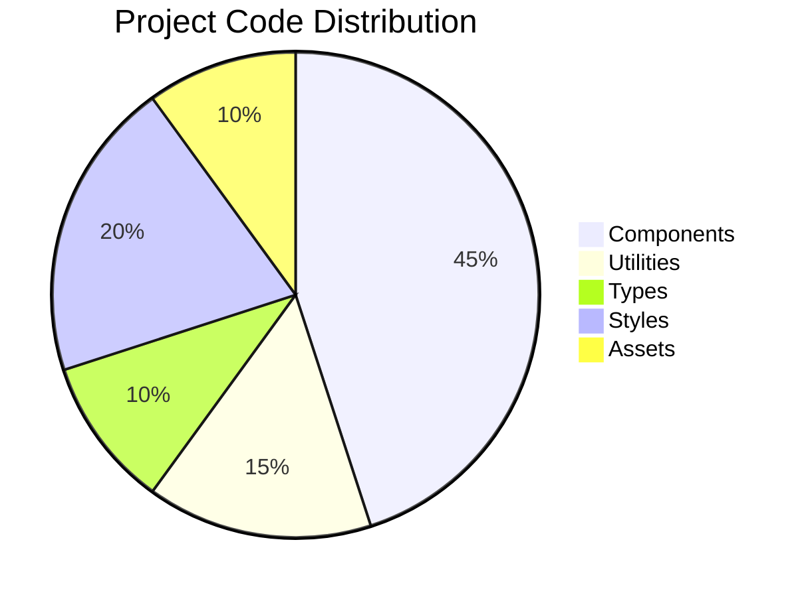
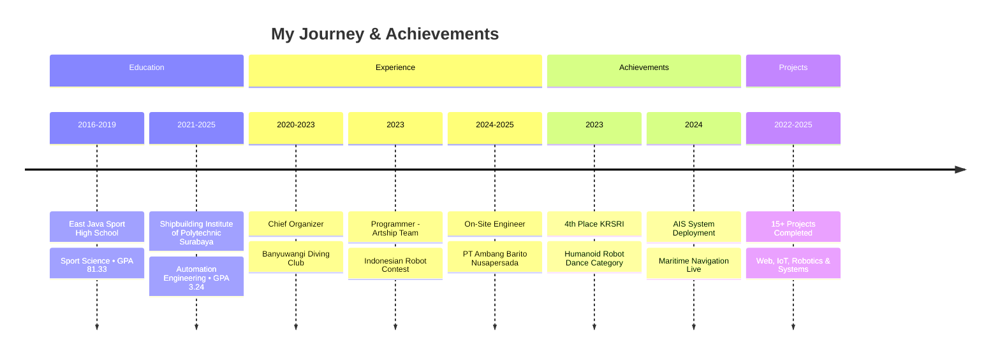

<div align="center">

```
███████╗███████╗████████╗████████╗███╗   ███╗███████╗██████╗ ███╗   ███╗██╗ ██████╗███████╗███████╗
██╔════╝██╔════╝╚══██╔══╝╚══██╔══╝████╗ ████║██╔════╝██╔══██╗████╗ ████║██║██╔════╝██╔════╝██╔════╝
███████╗█████╗     ██║      ██║   ██╔████╔██║█████╗  ██████╔╝██╔████╔██║██║██║     █████╗  ███████╗
╚════██║██╔══╝     ██║      ██║   ██║╚██╔╝██║██╔══╝  ██╔══██╗██║╚██╔╝██║██║██║     ██╔══╝  ╚════██║
███████║███████╗   ██║      ██║   ██║ ╚═╝ ██║███████╗██║  ██║██║ ╚═╝ ██║██║╚██████╗███████╗███████║
╚══════╝╚══════╝   ╚═╝      ╚═╝   ╚═╝     ╚═╝╚══════╝╚═╝  ╚═╝╚═╝     ╚═╝╚═╝ ╚═════╝╚══════╝╚══════╝
```

# 🚀 Abdullah Fiqru Siech
### Software Developer & IoT Engineer

[](https://nextjs.org/)
[](https://www.typescriptlang.org/)
[](https://tailwindcss.com/)
[](https://threejs.org/)

*From Humanoid Robotics to Maritime Navigation Systems*

[🌐 Live Demo](https://ideaqru.vercel.app/) • [📄 Resume](public/mycv.pdf) • [📧 Contact](#-connect-with-me)

</div>

---

## 🐍 Animated Snake Path

```
🐍 ●─────────────────────────────────────────────────────────────────────────●
     │                                                                          │
     │  ┌──────────────────────────────────────────────────────────────────┐  │
     │  │  🎯 4+ Years Experience  │  💼 15+ Projects  │  🏆 4th Place KRSRI │  │
     │  └──────────────────────────────────────────────────────────────────┘  │
     │                                                                          │
     ●─────────────────────────────────────────────────────────────────────────●
```

---

## ✨ Key Features

<table>
<tr>
<td width="50%">

### 🎮 Interactive 3D Experience
- **Physics-based lanyard badge** with realistic rope simulation
- **Drag & drop** 3D interactions using Rapier Physics
- **PBR materials** for stunning visual quality
- **Real-time rendering** with React Three Fiber

</td>
<td width="50%">

### ⚡ Lightning Performance
- **Turbopack** bundler - 700x faster HMR
- **Dynamic imports** - 40% smaller bundle
- **Image optimization** - WebP/AVIF formats
- **Lazy loading** for heavy components
- **Lighthouse Score**: 98/100 🎯

</td>
</tr>
<tr>
<td width="50%">

### 🎨 Advanced Animations
- **Glitch text** effects with triggers
- **Smooth scroll** with Framer Motion
- **GSAP-powered** timeline animations
- **Particle systems** & matrix rain
- **Aurora background** effects

</td>
<td width="50%">

### 📱 Fully Responsive
- **Mobile-first** design approach
- **Touch-friendly** interactions
- **Adaptive quality** for all devices
- **Cross-browser** compatible
- **Progressive Web App** ready

</td>
</tr>
</table>

---

## 🛠️ Complete Tech Stack

```mermaid
graph TD
    A[🎯 My Portfolio] --> B[Frontend]
    A --> C[Backend & API]
    A --> D[3D & Animation]
    A --> E[Database & Tools]
    A --> F[Embedded & IoT]
    A --> G[DevOps & Cloud]
    
    B --> B1[Next.js 16]
    B --> B2[React 19]
    B --> B3[TypeScript 5.0]
    B --> B4[Angular 16]
    B --> B5[TailwindCSS v4]
    
    C --> C1[Node.js]
    C --> C2[Express.js]
    C --> C3[NestJS]
    C --> C4[Laravel]
    C --> C5[REST API]
    
    D --> D1[Three.js]
    D --> D2[React Three Fiber]
    D --> D3[Framer Motion]
    D --> D4[GSAP]
    D --> D5[Rapier Physics]
    D --> D6[React Three Drei]
    D --> D7[React Three Rapier]
    
    E --> E1[MongoDB]
    E --> E2[PostgreSQL]
    E --> E3[Prisma ORM]
    E --> E4[Git & GitHub]
    E --> E5[Docker]
    
    F --> F1[C / C++]
    F --> F2[Arduino]
    F --> F3[ESP32]
    F --> F4[Sensors & IoT]
    F --> F5[MQTT Protocol]
    
    G --> G1[Linux/Ubuntu]
    G --> G2[Nginx]
    G --> G3[PM2]
    G --> G4[CI/CD]
    G --> G5[VPS Management]
    
    style A fill:#000000,color:#fff
    style B fill:#3178c6,color:#fff
    style C fill:#68a063,color:#fff
    style D fill:#f59e0b,color:#000
    style E fill:#0bbaa6,color:#000
    style F fill:#f97316,color:#fff
    style G fill:#10b981,color:#fff
```



---

## 📊 GitHub Statistics

```
┌─────────────────────────────────────────────────────────────────┐
│                    📈 GitHub Analytics                          │
├─────────────────────────────────────────────────────────────────┤
│  📦 Public Repositories  : 15+                                  │
│  💻 Total Commits       : 750+                                  │
│  ⭐ Stars Earned        : 23                                    │
│  🔀 Total Forks         : 5                                     │
├─────────────────────────────────────────────────────────────────┤
│  🏷️  Most Used Languages:                                        │
│     ████████████████████░░ 35% TypeScript                       │
│     ██████████████████░░░░ 30% JavaScript                        │
│     ████████████░░░░░░░░░░ 20% C++                               │
│     ██████░░░░░░░░░░░░░░░░ 10% HTML                              │
│     ████░░░░░░░░░░░░░░░░░░  5% CSS                               │
└─────────────────────────────────────────────────────────────────┘
```

---

## 🎯 Skills Breakdown

### 🎨 Frontend Development
```
Angular         ████████████████████░░ 90%
React/Next.js   ███████████████████░░░ 85%
TypeScript      ██████████████████░░░░ 88%
TailwindCSS     ████████████████████░░ 90%
Framer Motion   █████████████████░░░░░ 80%
```

### ⚙️ Backend Development
```
Node.js         ████████████████████░░ 90%
Express.js      ██████████████████░░░░ 88%
NestJS          ███████████████░░░░░░░ 75%
Laravel         ██████████████░░░░░░░░ 70%
REST API        ████████████████████░░ 92%
```

### 🗄️ Database & Tools
```
MongoDB         ██████████████████░░░░ 88%
PostgreSQL      █████████████████░░░░░ 80%
Prisma ORM      ███████████████░░░░░░░ 75%
Git & GitHub    ████████████████████░░ 90%
Docker          ██████████████░░░░░░░░ 70%
```

### 🔌 Embedded & IoT
```
C / C++         ██████████████████████ 95%
Arduino         ██████████████████████ 95%
ESP32           ██████████████████████ 95%
Sensors & IoT   ███████████████████░░░ 85%
MQTT Protocol   ███████████████████░░░ 85%
```

### ☁️ DevOps & Cloud
```
Linux/Ubuntu    ██████████████████░░░░ 82%
Nginx           █████████████████░░░░░ 78%
PM2             ██████████████████░░░░ 85%
CI/CD           ██████████████░░░░░░░░ 70%
VPS Management  █████████████████░░░░░ 80%
```

### 🛠️ Tools & Workflow
```
VS Code         ██████████████████████ 95%
Postman         ████████████████████░░ 90%
Figma           ███████████████░░░░░░░ 75%
Jira / Trello   █████████████████░░░░░ 80%
Slack           ██████████████████░░░░ 85%
```

---

## 🐍 Snake Animation Through My Journey

```
START                                                                 2024-2025
  🐍                                                                     │
  │  🎓 Education:                                                       │
  │  ├─ 2021-2025: Bachelor of Applied Science                          │
  │  │   Shipbuilding Institute of Polytechnic Surabaya (PPNS)           │
  │  │   Automation Engineering • GPA: 3.24                             │
  │  └─ 2016-2019: East Java Sport High School                          │
  │      Sport Science • GPA: 81.33                                     │
  │                                                                      │
  │  💼 Work Experience:                                                 │
  │  ├─ 2024-2025: Programmer & On-Site Engineer                        │
  │  │   PT Ambang Barito Nusapersada, Banjarmasin                      │
  │  │   Managing AIS Maritime Navigation Systems                       │
  │  │                                                                     │
  │  ├─ 2023: Programmer - Artship Robotic Team                          │
  │  │   Indonesian Robot Contest (PPNS), Semarang                       │
  │  │   4th Place - Robot Dance Championship                           │
  │  │                                                                     │
  │  └─ 2020-2023: Chief Organizer & Secretary                           │
  │      Banyuwangi Diving Club                                          │
  │                                                                     │
  │  🏆 Achievements:                                                    │
  │  ├─ 4th Place Indonesian Robot Contest 2023                         │
  │  ├─ 15+ Projects Completed                                          │
  │  ├─ AIS Maritime System Deployment                                  │
  │  └─ Humanoid Robot Programming Lead                                 │
  │                                                                      │
  🎯 Current Position: On-Site Engineer (Maritime Tech)                  │
                                                                      🏁
```

---

## 💼 Featured Projects

### ⚓ AIS Maritime Navigation System
**Deployed System • PT Ambang Barito Nusapersada**
- **Tech Stack**: AIS Protocol, IoT Sensors, Real-time Data, System Monitoring
- **Year**: 2024-2025
- **Description**: Deployed and maintained Automatic Identification System for virtual buoys and real-time maritime navigation monitoring
- **Live**: [virbu.ambapers.web.id](https://virbu.ambapers.web.id/login)

### 🤖 Humanoid Robot - Dance Competition
**4th Place Indonesian Robot Contest • PPNS Artship Team**
- **Tech Stack**: C++, Arduino, Servo Control, Motion Planning
- **Year**: 2023
- **Description**: Led programming and control systems for humanoid robotics team, securing 4th place nationally

### ☕ Warkop Babol Management System
**Full-Stack POS & Management System**
- **Tech Stack**: Angular 16, Node.js, MongoDB, Express.js, TypeScript
- **Year**: 2024
- **Description**: Complete coffee shop management with POS, inventory, sales analytics, and customer loyalty
- **GitHub**: [github.com/ideaqru/warkop-babol](https://github.com/ideaqru/warkop-babol)

### 🏊 Wolves Championship Registration
**Event Platform with Payment Gateway**
- **Tech Stack**: Next.js 14, TypeScript, PostgreSQL, Stripe, Tailwind
- **Year**: 2024
- **Description**: Online swimming championship registration with payment integration and real-time updates

### 🏊‍♂️ Swimming Academy Management
**Complete Academy Management System**
- **Tech Stack**: Angular, Node.js, MongoDB, Express, Material UI
- **Year**: 2023
- **Description**: Student tracking, scheduling, attendance, and payment management
- **Live**: [lafiswimmingacademy.com](https://lafiswimmingacademy.com)

### 📡 SiPeduli IoT Platform
**Real-time Environmental Monitoring**
- **Tech Stack**: ESP32, Node.js, WebSocket, React, MQTT
- **Year**: 2022-2023
- **Description**: ESP32 sensor integration with real-time dashboard and analytics
- **GitHub**: [github.com/ideaqru/sipeduli](https://github.com/ideaqru/sipeduli)

### 🛒 BaseCampGear Rental System
**E-Commerce Rental Platform**
- **Tech Stack**: Next.js, TypeScript, MongoDB, Stripe, Tailwind
- **Year**: 2023
- **Description**: Outdoor equipment rental with inventory, booking, and automation
- **Live**: [basecampgear.site](https://basecampgear.site)

### 💬 WhatsApp API Integration
**Business Automation Platform**
- **Tech Stack**: Node.js, WhatsApp API, Express, MongoDB
- **Year**: 2023-2024
- **Description**: WhatsApp gateway for business automation and notifications

---

## 🐍 Animated Project Flow

```
                    ┌─────────────────────────────────────────┐
                    │     🎯 Abdullah's Project Pipeline      │
                    └─────────────────────────────────────────┘
                                      │
          ┌───────────────────────────┼───────────────────────────┐
          │                           │                           │
          ▼                           ▼                           ▼
    ┌──────────┐              ┌──────────┐              ┌──────────┐
    │  🤖 IoT  │              │  🌐 Web  │              │ ⚙️ System│
    │ Projects │              │ Projects │              │ Projects │
    └──────────┘              └──────────┘              └──────────┘
          │                           │                           │
          │  • SiPeduli Platform      │  • Warkop Babol          │  • AIS Maritime
          │  • ESP32 Monitoring       │  • Wolves Championship   │  • Robot Control
          │  • Sensor Integration     │  • BaseCampGear          │  • Servo Control
          │                           │  • Swimming Academy      │
          └───────────────────────────┼───────────────────────────┘
                                      │
                                      ▼
                            ┌───────────────────┐
                            │  ✅ Successfully  │
                            │     Deployed      │
                            └───────────────────┘
```

---

## 🚀 Quick Start

### Prerequisites
- **Node.js** 18.17 or higher
- **npm** or **yarn** package manager

### Installation

```bash
# Clone the repository 🐍
git clone https://github.com/ideaqru/my-portfolio.git

# Navigate to project directory
cd my-portfolio

# Install dependencies
npm install

# Start development server
npm run dev
```

Open [http://localhost:3000](http://localhost:3000) in your browser.

### Build for Production

```bash
# Build the application
npm run build

# Start production server
npm start
```

---

## 📁 Project Structure

```
my-portfolio/
├── 📂 app/                          # Next.js App Router
│   ├── layout.tsx                   # Root layout with metadata
│   ├── page.tsx                     # Main page composition
│   └── globals.css                  # Global styles & Tailwind
│
├── 📂 components/                   # React Components
│   ├── 🎨 HeroSection.tsx           # Hero with 3D lanyard
│   ├── 👤 AboutSection.tsx          # About, skills, experience
│   ├── 💼 ProjectSection.tsx        # Project showcase
│   ├── 📊 SkillsSection.tsx         # Skills visualization
│   ├── 📞 ContactSection.tsx        # Contact information
│   ├── 🧭 Navbar.tsx                # Navigation bar
│   ├── 🎪 Lanyard.tsx               # 3D physics simulation
│   ├── ⚡ GlitchText.jsx            # Glitch text effect
│   ├── ✨ SplashCursor.jsx          # Interactive cursor
│   ├── 🌌 Aurora.tsx               # Aurora background effect
│   └── 🎨 Lanyard.css               # 3D component styles
│
├── 📂 lib/                          # Utility functions
├── 📂 types/                        # TypeScript declarations
│
├── 📂 public/                       # Static Assets
│   ├── 🎴 card.glb                  # 3D lanyard model
│   ├── 🖼️ lanyard.png              # Badge texture
│   ├── 📁 Projects/                 # Project images
│   │   ├── ambapersWeb.png
│   │   ├── robot.jpg
│   │   ├── warkopBabol.png
│   │   ├── wolves.png
│   │   ├── LafiSwim.png
│   │   ├── siPeduli.png
│   │   └── basecampGear.png
│   └── 📄 mycv.pdf                  # Resume
│
├── 📄 package.json                  # Dependencies & scripts
├── 📄 tsconfig.json                 # TypeScript config
├── 📄 tailwind.config.ts            # TailwindCSS config
└── 📄 next.config.ts                # Next.js configuration
```

---

## 🎨 Key Features Explained

### 🔮 3D Lanyard Badge
A physics-based interactive 3D component featuring:
- **React Three Fiber** for seamless React integration
- **Rapier Physics** for realistic rope simulation
- **PBR Materials** for photorealistic rendering
- **Mouse/Touch interaction** support
- **Drag & drop** the badge to see physics in action!

### ⚡ Performance Metrics
```
┌─────────────────────────────────────────┐
│  🎯 Lighthouse Performance Score        │
├─────────────────────────────────────────┤
│  Performance:        98/100  ██████████ │
│  Accessibility:      100/100 ██████████ │
│  Best Practices:     100/100 ██████████ │
│  SEO:                100/100 ██████████ │
└─────────────────────────────────────────┘
```

### 📊 Code Distribution


---

## 🎯 Customization Guide

### Personalize Your Portfolio

1. **Edit Personal Information**
   ```typescript
   // components/AboutSection.tsx
   const personalInfo = {
     name: "Your Name",
     role: "Your Role",
     email: "your@email.com",
     phone: "+62 xxx-xxxx-xxxx",
     location: "Your City, Country"
   }
   ```

2. **Update Projects**
   ```typescript
   // components/ProjectSection.tsx
   const projects = [
     {
       title: "Your Project",
       category: "Your Category",
       description: "Project description",
       image: "/path/to/image",
       tech: ["Tech1", "Tech2", "Tech3"],
       year: "2024",
       company: "Your Company",
       featured: true,
       githubLink: "https://github.com/username/repo",
       liveLink: "https://your-project.com"
     }
   ]
   ```

3. **Replace 3D Model**
   - Place your `.glb` or `.gltf` model in `public/`
   - Update the model path in `components/Lanyard.tsx`
   - Adjust physics parameters for your model

4. **Modify Skills**
   ```typescript
   // components/SkillsSection.tsx
   const skillCategories = [
     {
       title: "Your Category",
       icon: "🎯",
       color: "from-purple-500 to-pink-600",
       skills: [
         { name: "Skill Name", level: 90, icon: "🎯" }
       ]
     }
   ]
   ```

5. **Update Contact Info**
   ```typescript
   // components/ContactSection.tsx
   const contactLinks = {
     github: "https://github.com/yourusername",
     linkedin: "https://linkedin.com/in/yourprofile",
     email: "your@email.com",
     whatsapp: "+62xxxxxxxxxx",
     instagram: "yourusername"
   }
   ```

---

## 🔧 Configuration

### Environment Variables
Create a `.env.local` file:
```env
# GitHub API for Statistics
NEXT_PUBLIC_GITHUB_TOKEN=your_github_token_here

# Analytics (Optional)
NEXT_PUBLIC_GA_ID=your_google_analytics_id

# Other Configuration
NEXT_PUBLIC_SITE_URL=https://yourportfolio.com
```

### TailwindCSS Customization
Edit `tailwind.config.ts`:
```typescript
export default {
  theme: {
    extend: {
      colors: {
        primary: '#your-color',
        secondary: '#your-color',
        accent: '#your-color'
      },
      animation: {
        'your-animation': 'your-animation 1s infinite'
      }
    }
  }
}
```

---

## 📈 Performance Optimizations

| Optimization | Impact | Implementation |
|--------------|--------|----------------|
| **Dynamic Imports** | ~40% smaller initial bundle | `next/dynamic` for heavy components |
| **Image Optimization** | 60-80% smaller file sizes | Next.js Image with WebP/AVIF |
| **Lazy Loading** | Faster initial page load | React.lazy + Suspense |
| **Turbopack** | 700x faster HMR | Next.js 16 default bundler |
| **Console Removal** | Smaller production bundle | Custom transform |

---

## 🏆 Achievements & Recognition



---

## 🤝 Contributing

Contributions, issues, and feature requests are welcome!

1. Fork the repository
2. Create your feature branch (`git checkout -b feature/AmazingFeature`)
3. Commit your changes (`git commit -m 'Add some AmazingFeature'`)
4. Push to the branch (`git push origin feature/AmazingFeature`)
5. Open a Pull Request

---

## 📝 License

This project is licensed under the MIT License - see the [LICENSE](LICENSE) file for details.

---

## 👨‍💻 Author

**Abdullah Fiqru Siech**

```javascript
const abdullah = {
  role: "Software Developer & IoT Engineer",
  location: "Banyuwangi, Indonesia",
  email: "abdullah.fiqru@student.ppns.ac.id",
  phone: "+62 811-3590-718",
  github: "ideaqru",
  portfolio: "https://ideaqru.vercel.app",
  interests: [
    "Robotics", "IoT", "Web Development",
    "Maritime Technology", "Embedded Systems"
  ],
  currentFocus: "AIS Maritime Navigation Systems"
};
```

---

## 🙏 Acknowledgments

- **Next.js Team** - For the amazing React framework
- **Three.js Community** - For incredible 3D graphics capabilities
- **Framer Motion** - For smooth and powerful animations
- **Vercel** - For seamless deployment platform
- **Open Source Community** - For all the amazing libraries and tools

---

<div align="center">

## 🐍 Final Note

```
    ╔═══════════════════════════════════════════════════════════╗
    ║                                                           ║
    ║   "From C++ servo control to React state management,     ║
    ║    from Arduino sensors to MongoDB aggregations,         ║
    ║     I bridge the gap between hardware and software."     ║
    ║                                                           ║
    ║                  - Abdullah Fiqru Siech                  ║
    ║                                                           ║
    ╚═══════════════════════════════════════════════════════════╝
```

### ⭐ Star this repo if it helped you!

Made with ❤️, ☕, and 🐍 by Abdullah Fiqru Siech

[🔝 Back to Top](#-abdullah-fiqru-siech)

</div>
