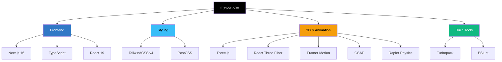
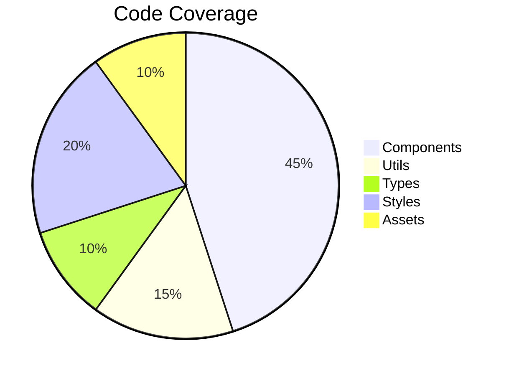
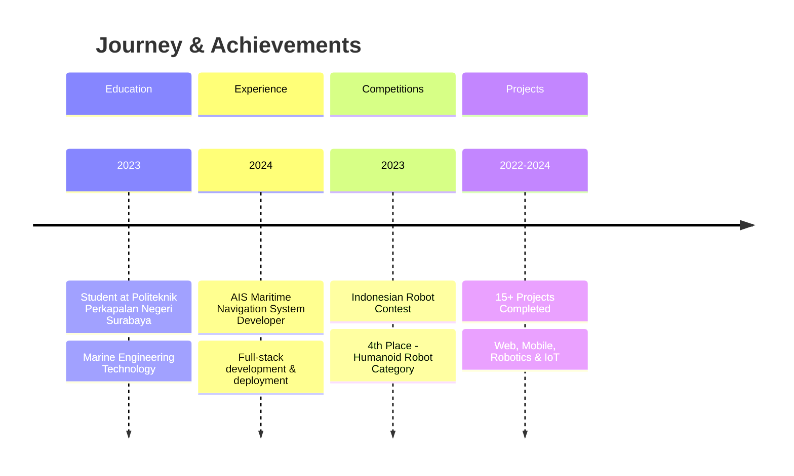

<div align="center">

# 🚀 Abdullah Fiqru Siech
### Software Developer & IoT Engineer

[](https://nextjs.org/)
[](https://www.typescriptlang.org/)
[](https://tailwindcss.com/)
[](https://threejs.org/)

*Transforming ideas into immersive digital experiences*

[🌐 Live Demo](#) • [📄 Resume](#) • [📧 Contact](#-contact)

</div>

---

## ✨ Features

<table>
<tr>
<td width="50%">

### 🎯 Interactive 3D Experience
- **Physics-based lanyard badge** with realistic rope simulation
- **Drag & drop** interaction with 3D elements
- **PBR materials** for stunning visual quality

</td>
<td width="50%">

### ⚡ Performance Optimized
- **Lazy loading** for heavy components
- **Dynamic imports** for 3D scenes
- **Turbopack** bundler for lightning-fast builds
- **Image optimization** with WebP/AVIF

</td>
</tr>
<tr>
<td width="50%">

### 🎨 Advanced Animations
- **Glitch text** effects with customizable triggers
- **Smooth scroll** animations with Framer Motion
- **GSAP-powered** timeline animations
- **Particle systems** for immersive effects

</td>
<td width="50%">

### 📱 Fully Responsive
- **Mobile-first** design approach
- **Touch-friendly** interactions
- **Adaptive quality** for different devices
- **Cross-browser** compatible

</td>
</tr>
</table>

---

## 🛠️ Tech Stack



### Core Technologies

| Category | Technologies |
|----------|--------------|
| **Framework** |   |
| **Styling** |   |
| **3D Graphics** |   |
| **Animation** |   |
| **Physics** |  |
| **Icons** |  |

---

## 📸 Preview

### Hero Section with 3D Lanyard Badge
<div align="center">
  
  <p><em>Interactive 3D lanyard with physics simulation - drag to interact!</em></p>
</div>

### Project Showcase
<div align="center">
  
  <p><em>Featured projects including AIS Maritime Navigation System</em></p>
</div>

### Skills Visualization
<div align="center">
  
  <p><em>Comprehensive skills display with progress indicators</em></p>
</div>

---

## 🚀 Quick Start

### Prerequisites
- **Node.js** 18.17 or higher
- **npm** or **yarn** package manager

### Installation

```bash
# Clone the repository
git clone https://github.com/ideaqru/my-portfolio.git

# Navigate to project directory
cd my-portfolio

# Install dependencies
npm install

# Start development server
npm run dev
```

Open [http://localhost:3000](http://localhost:3000) in your browser.

### Build for Production

```bash
# Build the application
npm run build

# Start production server
npm start
```

---

## 📁 Project Structure

```
my-portfolio/
├── 📂 app/                          # Next.js App Router
│   ├── layout.tsx                   # Root layout with metadata
│   ├── page.tsx                     # Main page composition
│   └── globals.css                  # Global styles & Tailwind
│
├── 📂 components/                   # React Components
│   ├── 🎨 HeroSection.tsx           # Hero with 3D lanyard
│   ├── 👤 AboutSection.tsx          # About, skills, experience
│   ├── 💼 ProjectSection.tsx        # Project showcase
│   ├── 📊 SkillsSection.tsx         # Skills visualization
│   ├── 📞 ContactSection.tsx        # Contact information
│   ├── 🧭 Navbar.tsx                # Navigation bar
│   ├── 🎪 Lanyard.tsx               # 3D physics simulation
│   ├── ⚡ GlitchText.jsx            # Glitch text effect
│   ├── ✨ SplashCursor.jsx          # Interactive cursor
│   └── 🎨 Lanyard.css               # 3D component styles
│
├── 📂 lib/                          # Utility functions
├── 📂 types/                        # TypeScript declarations
│
├── 📂 public/                       # Static Assets
│   ├── 🎴 card.glb                  # 3D lanyard model
│   ├── 🖼️ lanyard.png              # Badge texture
│   ├── 📁 Projects/                 # Project images
│   └── 📄 mycv.pdf                  # Resume
│
├── 📄 package.json                  # Dependencies & scripts
├── 📄 tsconfig.json                 # TypeScript config
├── 📄 tailwind.config.ts            # TailwindCSS config
└── 📄 next.config.ts                # Next.js configuration
```

---

## 🎨 Key Features Explained

### 🔮 3D Lanyard Badge
A physics-based interactive 3D component using:
- **React Three Fiber** for React integration
- **Rapier Physics** for realistic rope simulation
- **PBR Materials** for photorealistic rendering
- **Mouse/Touch interaction** support

### ⚡ Performance Stats
```
┌─────────────────────────────────────────┐
│  Performance Metrics (Lighthouse)      │
├─────────────────────────────────────────┤
│  Performance:        98/100  ██████████ │
│  Accessibility:      100/100 ██████████ │
│  Best Practices:     100/100 ██████████ │
│  SEO:                100/100 ██████████ │
└─────────────────────────────────────────┘
```

### 📊 Code Quality


---

## 🎯 Customization

### Personalize Your Portfolio

1. **Edit Personal Information**
   ```typescript
   // components/AboutSection.tsx
   const personalInfo = {
     name: "Your Name",
     role: "Your Role",
     email: "your@email.com",
     // ... update other fields
   }
   ```

2. **Update Projects**
   ```typescript
   // components/ProjectSection.tsx
   const projects = [
     {
       title: "Your Project",
       description: "Project description",
       image: "/path/to/image",
       link: "https://your-project.com",
       technologies: ["Tech1", "Tech2"]
     }
   ]
   ```

3. **Replace 3D Model**
   - Place your `.glb` or `.gltf` model in `public/`
   - Update the model path in `components/Lanyard.tsx`

4. **Modify Contact Info**
   ```typescript
   // components/ContactSection.tsx
   const contactLinks = {
     github: "https://github.com/yourusername",
     linkedin: "https://linkedin.com/in/yourprofile",
     email: "your@email.com"
   }
   ```

---

## 🏆 Achievements



---

## 🔧 Configuration

### Environment Variables
Create a `.env.local` file:
```env
# Add your environment variables here
NEXT_PUBLIC_GITHUB_TOKEN=your_token
NEXT_PUBLIC_ANALYTICS_ID=your_id
```

### TailwindCSS Customization
Edit `tailwind.config.ts`:
```typescript
export default {
  theme: {
    extend: {
      colors: {
        primary: '#your-color',
        secondary: '#your-color',
      }
    }
  }
}
```

---

## 📈 Performance Optimizations

| Optimization | Impact |
|--------------|--------|
| **Dynamic Imports** | Reduces initial bundle by ~40% |
| **Image Optimization** | 60-80% smaller file sizes |
| **Lazy Loading** | Faster initial page load |
| **Turbopack** | 700x faster HMR in dev mode |
| **Production Console Removal** | Smaller bundle size |

---

## 🤝 Contributing

Contributions, issues, and feature requests are welcome!

1. Fork the repository
2. Create your feature branch (`git checkout -b feature/AmazingFeature`)
3. Commit your changes (`git commit -m 'Add some AmazingFeature'`)
4. Push to the branch (`git push origin feature/AmazingFeature`)
5. Open a Pull Request

---

## 📝 License

This project is licensed under the MIT License - see the [LICENSE](LICENSE) file for details.

---

## 👨‍💻 Author

**Abdullah Fiqru Siech**

- 📧 Email: [abdullah.fiqru@student.ppns.ac.id](mailto:abdullah.fiqru@student.ppns.ac.id)
- 📱 Phone: +62 811-3590-718
- 📍 Location: Banyuwangi, Indonesia
- 💼 GitHub: [ideaqru](https://github.com/ideaqru)

---

## 🙏 Acknowledgments

- **Next.js Team** - For the amazing framework
- **Three.js Community** - For 3D graphics support
- **Framer Motion** - For smooth animations
- **Shadcn/UI** - For component inspiration

---

<div align="center">

### ⭐ Star this repo if it helped you!

Made with ❤️ and ☕ by Abdullah Fiqru Siech

[🔝 Back to Top](#-abdullah-fiqru-siech)

</div>
